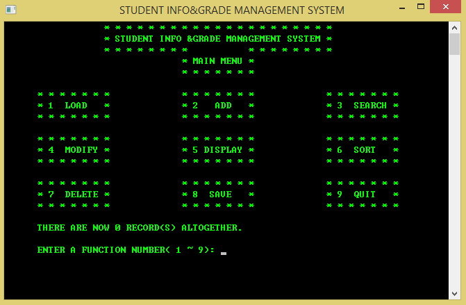

# Grade Management System
# 成绩管理系统

## Features
## 描述

+ Written under Visual C++ 6.0
+ 开发环境：VC++ 6.0

+ Powered by single linked lists
+ 支撑数据结构：单链表

+ Object-oriented to the apex of my knowledge then
+ 竭力模仿面向对象编程

## TODO
## 改进

But actually I failed to satisfactorily emualate
object-oriented programming due to lack of aquaintance
of the implementation of C++.

由于当时年少不懂事，没有模仿好，我觉得可以做得更好。

## Copyright
## 版权

Copyright 2014 - 2015 Gu Zhengxiong <rectigu@gmail.com>

## License
## 授权

GPL
